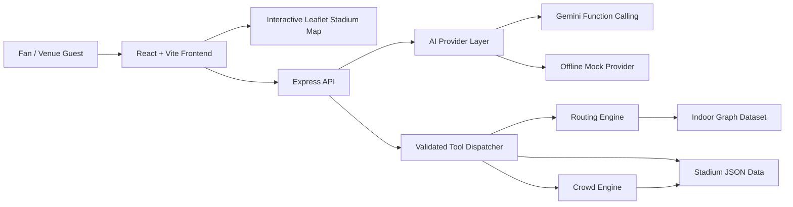
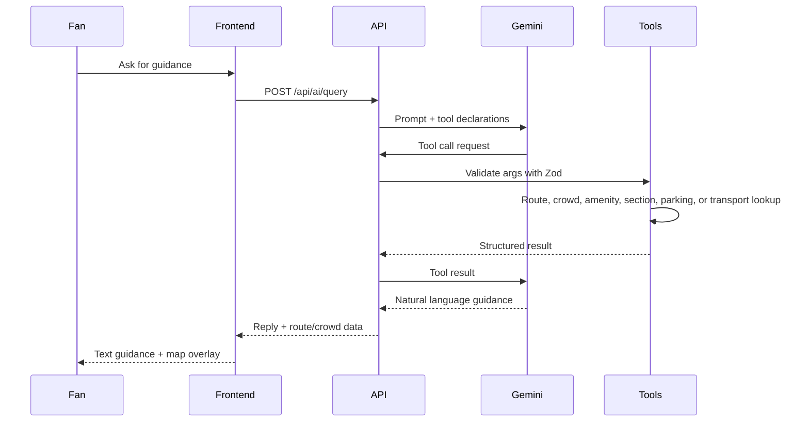

# StadiumPilot AI

AI-powered indoor navigation and accessibility assistant for MetLife Stadium.

StadiumPilot AI combines an interactive stadium map, accessible route planning, crowd-aware guidance, amenity lookup, transport information, and Gemini function calling. It is designed as a hackathon-ready production reference for helping fans move through a large venue with clearer, safer, and more context-aware guidance.

Educational reference only. Not affiliated with or endorsed by MetLife Stadium, the NFL, FIFA, or NJ Transit.

## Features

| Area | Capability |
| --- | --- |
| Navigation | Indoor route guidance from gates to sections, amenities, exits, and transport points |
| Accessibility | Accessible-mode routing, elevator-aware directions, wheelchair-accessible amenity badges |
| AI Guidance | Gemini function calling with backend-validated tools and offline mock fallback |
| Interactive Map | Leaflet stadium map with route polyline, start/end markers, and accessible route styling |
| Crowd Awareness | Deterministic event-phase crowd simulation and hotspot-aware route penalties |
| Amenities | Food, restrooms, medical, security, and merchandise filtering |
| Transport | Rail, bus, rideshare, parking, and post-event travel details |
| Reliability | Zod validation, centralized error handling, request IDs, health check, production builds |
| Accessibility UX | Skip link, ARIA labels, live regions, keyboard navigation, focus states, non-color-only status labels |

## Architecture



## AI Function Calling Flow



## Tech Stack

| Layer | Technology |
| --- | --- |
| Frontend | React 19, TypeScript, Vite |
| Styling | Tailwind CSS v4, custom responsive CSS |
| State | Zustand |
| Maps | Leaflet, react-leaflet |
| i18n | i18next, react-i18next |
| Backend | Node.js, Express 5, TypeScript |
| AI | Google Gemini with mock provider fallback |
| Validation | Zod |
| Security | Helmet, strict CORS, request body limits |
| Testing | Vitest |
| Deployment | Vercel/Firebase frontend, Render-compatible backend |

## Folder Structure

```text
stadium/
  backend/
    src/
      ai/          Gemini/mock provider, system prompt, tool declarations
      data/        Stadium graph, sections, gates, amenities, parking, transport
      engines/     Routing and crowd engines with unit tests
      routes/      AI, crowd, stadium, and health API routes
      tools/       Function-calling handlers and Zod schemas
  frontend/
    src/
      api/         Typed Axios client
      components/  Assistant, map, route, crowd, amenity, transport panels
      i18n/        English, Spanish, French, Hindi translations
      pages/       Landing and dashboard pages
      store/       Zustand domain state
```

## Installation

Prerequisites:

- Node.js 20+
- npm 10+
- Gemini API key for live AI mode

Backend:

```bash
cd backend
cp .env.example .env
npm install
npm run dev
```

Frontend:

```bash
cd frontend
cp .env.example .env
npm install
npm run dev
```

Local URLs:

- Frontend: `http://localhost:5173`
- Backend: `http://localhost:3001`
- Health check: `http://localhost:3001/api/health`

## Configuration

Backend environment variables:

| Variable | Required | Default | Description |
| --- | --- | --- | --- |
| `GEMINI_API_KEY` | Live AI only | none | Google Gemini API key |
| `AI_PROVIDER` | No | `mock` | Use `gemini` or `mock` |
| `PORT` | No | `3001` | API server port |
| `FRONTEND_ORIGIN` | No | `http://localhost:5173` | Comma-separated allowed CORS origins |

Frontend environment variables:

| Variable | Required | Default | Description |
| --- | --- | --- | --- |
| `VITE_API_URL` | No | `http://localhost:3001/api` | Backend API base URL |

## API Endpoints

| Method | Path | Purpose |
| --- | --- | --- |
| `POST` | `/api/ai/query` | AI assistant query with optional history and accessibility mode |
| `GET` | `/api/crowd` | Live crowd simulation and hotspots |
| `GET` | `/api/stadium/amenities?type=food` | Stadium amenities, optionally filtered |
| `GET` | `/api/stadium/transport` | Rail, bus, rideshare, and travel notes |
| `GET` | `/api/stadium/parking` | Parking lot and accessible-space data |
| `GET` | `/api/health` | API readiness, uptime, provider, timestamp |

## Routing Engine

The backend represents the stadium as a weighted indoor graph. The routing engine resolves human-friendly labels such as `Gate A` or `Section 300`, then runs priority-queue pathfinding with optional accessibility and crowd penalties.

Route outputs include:

- Ordered graph path and node metadata
- Human-readable turn-by-turn instructions
- Estimated walking minutes
- Accessible-route flag
- Crowd-adjusted-route flag

## Accessibility

Accessibility is a first-class workflow, not a cosmetic toggle.

- Accessible mode influences backend route computation
- Elevator and accessible edge metadata are part of the graph
- Route rendering uses dashed styling for accessible paths
- Assistant messages use live regions and copy controls with labels
- Panels include loading, empty, and error states
- Skip link and semantic landmarks support keyboard and screen reader navigation
- Color-coded statuses include text labels and ARIA metadata

## Security

- API keys stay on the backend
- AI tool arguments are validated with Zod before execution
- Express JSON body size is limited to `50kb`
- CORS is restricted to configured frontend origins
- Helmet applies secure HTTP headers
- Request IDs are included in responses for support/debugging
- Static stadium data receives short-lived cache headers
- Live crowd data is marked `no-store`
- No secrets are committed; `.env.example` files contain placeholders only

## Testing

Backend tests cover routing, crowd generation, tool handlers, and validation schemas.

```bash
cd backend
npm test
```

Production builds:

```bash
cd backend
npm run build

cd ../frontend
npm run build
```

## Deployment

Backend deployment, Render-style:

```bash
cd backend
npm ci
npm run build
npm start
```

Set these backend environment variables in the host:

```text
AI_PROVIDER=gemini
GEMINI_API_KEY=<your-key>
FRONTEND_ORIGIN=https://<your-frontend-domain>
PORT=3001
```

Frontend deployment, Vercel/Firebase-style:

```bash
cd frontend
npm ci
npm run build
```

For Vercel, set `VITE_API_URL=/api` and keep `frontend/vercel.json` rewrites pointed at the deployed backend. For Firebase Hosting, deploy `frontend/dist` using `frontend/firebase.json`.

## Screenshots

Add final submission screenshots here:

- Dashboard with AI assistant and route overlay
- Accessible route request from gate to section
- Crowd-aware guidance and hotspot panel
- Amenity filtering panel

## Future Improvements

- Integrate official live venue feeds when available
- Add multi-floor indoor tiles from a venue-approved source
- Add user location handoff from native/mobile web
- Add end-to-end browser tests for critical navigation flows
- Add OpenTelemetry tracing for production AI/tool latency

## License

ISC. Educational reference only.

## Acknowledgements

Built with React, Vite, Express, Leaflet, Zustand, Zod, Vitest, and Google Gemini.
